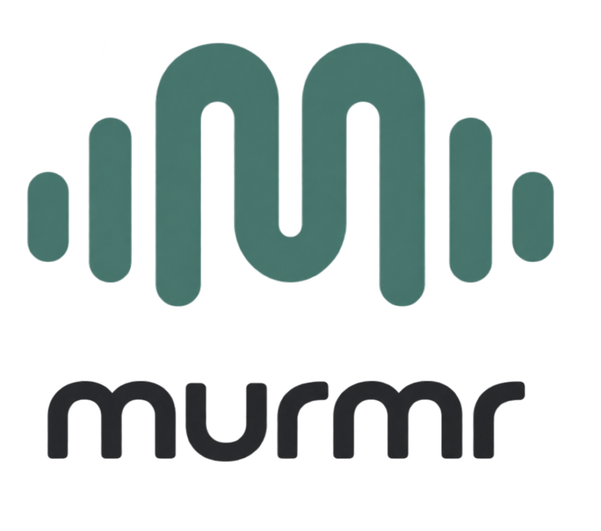

<p align="center">
  
</p>

# murmr

Speak into your phone; the words appear wherever your computer's cursor is.

murmr turns an Android phone into a push-to-talk voice keyboard. Hold a button, talk, let go.
The phone transcribes the speech on-device and types the result into the paired computer. The
computer sees an ordinary Bluetooth keyboard, so there is nothing to install on it.

```
   Android phone                                          Computer (any OS)
 ┌──────────────────────────────────────────────┐        ┌──────────────────────────┐
 │ hold PTT ─▶ mic ─▶ on-device STT ─▶ text     │──BT───▶│ Bluetooth HID keyboard   │
 │                         └─▶ HID key reports  │        │   ─▶ focused text field  │
 └──────────────────────────────────────────────┘        └──────────────────────────┘
```

## Status

v0. The debug build is green but nothing has run on a phone yet, so the Bluetooth keyboard and
speech paths are unproven. Next: install on a phone, pair with a computer, and run the
50-dictation test in [docs/testing.md](docs/testing.md). Design decisions and the roadmap are in
[docs/architecture.md](docs/architecture.md).

## How it works

- **Push-to-talk:** hold the big on-screen button, or Volume Down while the app is open.
  Everything you say while holding is typed once, when you release.
- **Speech-to-text:** Android's on-device `SpeechRecognizer`. By default the app refuses to
  fall back to an online engine; it tells you to install the offline language pack instead.
  The engine sits behind a small `SttEngine` interface so whisper.cpp or sherpa-onnx can
  replace it.
- **Transport:** the phone registers itself as a Bluetooth HID keyboard (`BluetoothHidDevice`,
  Android 9+) and sends key press/release reports for each character. Delivery is behind a
  `Transport` interface; a companion app on the computer is planned for images, unicode, and
  iPhone.
- **Host:** anything that accepts a Bluetooth keyboard: Windows, macOS, Linux, ChromeOS, iPad.

## Repository layout

```
android/                          Android Studio project (Kotlin, Jetpack Compose, Material 3)
  app/src/main/java/dev/murmr/app/
    hid/                          Bluetooth HID keyboard: descriptor, US key map, HidKeyboard, TextTyper
    stt/                          SttEngine interface, OfflinePolicy, Android SpeechRecognizer engine
    transport/                    Transport interface: what can reach the computer and how
    service/                      MurmrService: foreground service + push-to-talk state machine
    ui/                           Compose screen and theme
    MainActivity.kt               permissions, service binding, Volume Down as PTT
docs/architecture.md              design decisions and roadmap
docs/testing.md                   Milestone 1 test protocol (50 consecutive dictations)
assets/branding/                  logo (source for the launcher icon and in-app mark)
CLAUDE.md                         working notes for Claude Code sessions
```

## Getting started

### Requirements

- Android Studio with Android SDK 35, plus a JDK 17 for Gradle (see "Build and install").
- A phone whose Bluetooth stack supports the HID *device* role. Pixels and most near-stock
  phones do; some Samsung models do not.
- **Android 12 or newer** for guaranteed on-device recognition, with the offline speech pack for
  your language installed. On Pixel: Settings → System → Languages → Speech → On-device
  recognition; the path varies by manufacturer. Android 9 to 11 can run the app only after
  allowing online recognition (a settings option on the roadmap; a constructor flag today).

### Build and install

Android Studio: open the `android` folder, let it sync, connect the phone with USB debugging
enabled, and press Run.

Command line: the Gradle wrapper is committed, so once the SDK is installed this is enough:

```bash
cd android && ./gradlew installDebug
```

Two machine-specific pieces of setup, both outside the repo:

- **JDK.** Gradle 8.11 runs on JDK 17 to 23. Recent Android Studio versions bundle a newer JDK,
  so install one (`winget install EclipseAdoptium.Temurin.17.JDK`) and point Gradle at it in
  `~/.gradle/gradle.properties`, which both the command line and Android Studio honour:

  ```
  org.gradle.java.home=C:/Program Files/Eclipse Adoptium/jdk-17.0.20.101-hotspot
  ```

- **SDK.** Android Studio's setup wizard installs it (on Windows under `%LOCALAPPDATA%\Android\Sdk`).
  `android/local.properties` (gitignored) must point `sdk.dir` at that folder.

### Pair with the computer

1. Open murmr and grant Microphone, Nearby devices, and Notifications.
2. Wait for "Keyboard ready" under **Computer**.
3. Tap **Make discoverable**. On the computer, open Bluetooth settings, add a device, and pick
   the phone. Confirm the pairing code on both ends.
4. If the phone was paired with the computer before murmr existed, remove that pairing on the
   computer first and pair again so it picks up the keyboard service.
5. Later sessions: tap the computer under **Paired devices** to reconnect, or connect from the
   computer's side.

### Dictate

Click into any text field on the computer. Hold the button on the phone, speak, release. The
text is typed a moment later, followed by a space. The phone shows exactly what was delivered.

## Known limitations (v0)

- **US keyboard layout only.** Characters are sent as US key positions; set the computer to a
  US layout for now.
- **ASCII only.** Accented letters are folded to their base letter and flagged; anything else
  without a US key (emoji, other scripts) is dropped and listed on the phone.
- **Typed after release**, not streamed while you speak. Deliberate: see the architecture doc.
- **App must be on screen** for push-to-talk. Android does not let apps intercept the power
  button; Volume Down is the hardware alternative.
- **Text only.** Images cannot cross a keyboard link. Planned: upload and type a URL, then a
  companion app for real attachments.
